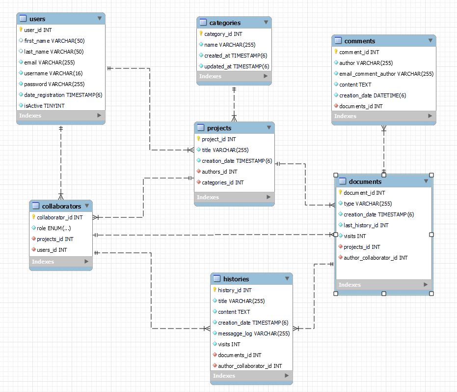

# Proyectos Colaborativos
<p align="center"></p>

## Idea
<p align="justify">Generar una aplicación web que albergue de forma online proyectos, con distintos escritos (documentos), que puedan ser consultados por cualquier persona que navegue el sitio. Los proyectos estarán categorizados y los documentos podrán ser editados por distintos usuarios registrados que estén asignados para tal fin.</p>
<p align="justify"> El sitio brindara herramientas para visualizar los proyectos a los usuarios por medio de un buscador general y ademas mostrara distintas secciones que agruparan por mas vistos, mas recientes entre otros.
Como particularidad cualquier usuario podra generar comentarios en los documentos para conocimientos del autor.</p>


## Descripción
<p align="justify">Para poder llevar a cabo la idea se resuelve entonces la creación de la aplicación <strong>Proyectos Colaborativos</strong>. De manera resumida podemos decir que los usuarios una vez registrados en la plataforma contarán con la posibilidad de crear uno o más proyectos, al que le deberán asignar una categoría al momento de su creación, conforme a las existentes, y además; el autor contara con la facultad de poder agregar distintos colaboradores (usuarios registrados en la plataforma) para que puedan ser parte en la edición, actualización y eliminación de los distintos documentos con que contará en su interior el proyecto creado.
Para poder lograr el sistema vamos a contar principalmente con las siguientes entidades que estarán interactuando según la necesidad planteada:
<ul>
<li>Usuario (user)</li>
<li>Proyecto (project)</li>
<li>Categoría (category)</li>
<li>Colaborador (collaborator)</li>
<li>Documento (document)</li>
<li>Revisión(history)</li>
<li>Comentario (comment)</li>
</ul>
</p>

## DML Proyectos Colaborativos
<p>Como resultado del analisis se resuelve ejecutar el siguiente modelado para cubrir las necesidades del proyecto.</p>
<p align=center></p> 
</br>
<p>A continuación se detallan las entidades con sus atributos, funcionalidades declaradas y se comenta tambien la relación que van a mantener entre las mismas.</p>
</br>

### Entidad USUARIO (tabla users)

<strong>Atributos</strong>
<table border="1" width=100%>
<thead><tr><th>Nombre</th><th>Detalle</th></tr></thead>
<tbody>
<tr><td>userId</td><td>
<ul>
<li>Representa el número de identificación del usuario.</li>
<li>Se genera automáticamente de forma incremental al darse de alta los usuarios.</li>
<li>Es único para cada usuario en la aplicación. </li>
</ul></td></tr>
<tr><td>email</td><td><ul>
<li>Representa el correo electrónico del usuario.</li>
<li>Como tal debe ser un formato válido de correo electrónico.</li>
<li>Debe ser único su uso en la aplicación, no pudiendo ser utilizado por otro usuario.</li>
<li>Obligatoriedad: Requerida.</li></ul> </td></tr>
<tr><td>password</td><td>
<ul><li>Representa la contraseña del usuario.</li> 
<li>Restricción: Debe contar con mas de 5 caracteres. No puede contener el caracter " ". </li>
<li>Obligatoriedad: Requerida.</li></ul> </td></tr>
<tr><td>firstName</td><td>
<ul><li>Representa el nombre de pila del usuario.</li>
<li>Restricción: No puede contener el caracter " ".De estar no puede ser vacio. </li>
<li>Obligatoriedad: Opcional.</li></ul></td></tr>
<tr><td>lastName</td><td>
<ul><li>Representa el apellido del usuario.</li>
<li>Restricción: No puede contener el caracter " ".De estar no puede ser vacio. </li>
<li>Obligatoriedad: Opcional.</li></ul>
</td></tr>
<tr><td>username</td><td>
<ul><li>Representa el nombre de usuario en la aplicación.</li>
<li>Restricción: Debe contar con mas de 5 caracteres.No puede contener el caracter " ".</li>
<li>Obligatoriedad: Requerida.</li></ul>
</td></tr>
<tr><td>dateRegistration</td><td>
<ul><li>Representa la fecha de alta del usuario en la aplicación.</li>
<li>Se asigna automaticamente cuando se crea el usuario.</li>
</ul>
</td></tr>
<tr><td>isActive</td><td>
<ul><li>Representa si el usuario esta activo en la aplicación.</li>
<li>Se asigna automáticamente cuando se crea el usuario.</li>
</ul></td></tr>    
<tr><td>projects</td><td>
<ul><li>Relación que vincula al usuario con los proyectos de su autoría.</li>
<li>Obligatoriedad: Opcional.</li></ul>
</td></tr>    
<tr><td>collaborators</td><td>
<ul><li>Relación que vincula al usuario como colaborador de los distintos proyectos donde es participe.</li>
<li>Obligatoriedad: Opcional.</li></ul> 
</td></tr>    
</tbody>
</table>
</br>
<strong>Funcionalidades</strong>
</br>
</br>

<table border="1" width=100%>
<thead><tr><th>Función</th><th>Descripción</th></tr></thead>
<tbody>
<tr><td>getUserId():number</td><td>Retorna el número de identificación del usuario.</td></tr>
<tr><td>getFirstName():string </td><td>Retorna el firstname del usuario.</td></tr>
<tr><td>getLastName():string </td><td>Retorna el lastname del usuario.</td></tr>
<tr><td>getEmail(): string </td><td>Retorna el email del usuario.</td></tr>
<tr><td>getUsername(): String</td><td>Retorna el username del usuario.</td></tr>
<tr><td>getPassword(): string </td><td>Retorna el password encriptado del usuario.</td></tr>
<tr><td>getDateRegistration(): any</td><td>Retorna la fecha de alta del usuario en la aplicación.</td></tr>
<tr><td>IsActive(): Boolean </td><td>Retorna verdadero si el usuario se encuentra activo,</br> falso en caso contrario.</td></tr>
<tr><td>setFirstName( newFirstName: string ): string</td><td>Asigna newFirstName al firstName del usuario.</td></tr>
<tr><td>setLastName( newLastName: string ): string </td><td>Asigna newLastName al lastName del usuario.</td></tr>
<tr><td>setPassword(newPassword: string): string </td><td>Asigna newPassword al usuario.</td></tr>
<tr><td>deactivate()</td><td>Asigna estado falso a isActive.</td></tr>
</tbody>
</table>
</br>
</br>

### Entidad PROYECTO (tabla projects)

<strong>Atributos</strong>
<table border="1" width=100%>
<thead><tr><th>Nombre</th><th>Detalle</th></tr></thead>
<tbody>
<tr><td>projectId</td><td><ul><li>Representa el número de identificación del proyecto.</li>
<li>Se genera automáticamente de forma incremental al darse de alta el proyecto.</li>
<li>Restricción: Valor único para cada proyecto de la aplicación. </li>
</ul></td></tr>
<tr><td>title</td><td><ul><li>Representa el título del proyecto.</li>
<li>Restricción: El título debe ser único por autor de proyecto. No puede ser vacio.</li>
<li>Obligatoriedad: Requerida.</li></ul></td></tr>
<tr><td>creationDate</td><td>
<ul><li>Representa la fecha de creación del proyecto en la aplicación.</li>
<li>Se asigna automáticamente cuando se crea el proyecto.</li>
</ul></td></tr>
<tr><td>author</td><td><ul><li>Relación que vincula a un usuario como author del proyecto.</li>
<li>Obligatoriedad: Requerida.</li></ul></td></tr>
<tr><td>category</td><td>
<ul><li>Relacion que vincula una categoría con el proyecto.</li> 
<li>Restricción: La categoría debe estar vigente dentro de la aplicación. De no existir la puede crear previamnente.</li>
<li>Obligatoriedad: Requerida.</li></ul></td></tr>
<tr><td>documents</td><td>
<ul><li>Relación que vincula los documentos que posee el proyecto.</li> 
<li>Obligatoriedad: Opcional.</li></ul></td></tr>
<tr><td>collaborators</td><td>
<ul><li>Relación que vincula los collaboradores que posee el proyecto.</li>
<li>Obligatoriedad: Opcional.</li>
</ul></td></tr>
 
</tbody>
</table>
</br>
<strong>Funcionalidades</strong>
</br></br>

<table border="1" width=100%>
<thead><tr><th>Función</th><th>Descripción</th></tr></thead>
<tbody>
<tr><td>getProjectId():number</td><td>Retorna el número de identificación del proyecto.</td></tr>
<tr><td>getTitle():string </td><td>Retorna el título del proyecto.</td></tr>
<tr><td>getCreationDate():any </td><td>Retorna la fecha de creación del proyecto.</td></tr>
<tr><td>getAuthor(): User </td><td>Retorna el usuario autor del proyecto.</td></tr>
<tr><td>getCategory(): Category</td><td>Retorna la categoría del proyecto.</td></tr>
<tr><td>setTitle(newTitle:String): void </td><td>Asigna newTitle al título del proyecto.</td></tr>
</tbody>
</table>
</br>
</br>


### Entidad DOCUMENTO (tabla documents)

<strong>Atributos</strong>
<table border="1" width=100%>
<thead><tr><th>Nombre</th><th>Detalle</th></tr></thead>
<tbody>
<tr><td>documentId</td>
<td>
<ul><li>Representa el número de identificación del documento.</li>
<li>Se genera automáticamente de forma incremental al darse de alta.</li>
<li>Valor único para cada documento en la aplicación.</li>
</ul>
</td></tr>
<tr><td>type</td>
<td><ul><li>Representa un tipo de documento.</li>
<li>Se aplica un valor predeterminado de nombre "TEXT".</br> Esta pensado para poder ampliar en un futuro tipo de documentos que se puedan generar.</li>
</ul></td></tr>
<tr><td>creationDate</td>
<td>
<ul><li>Representa la fecha de creación del documentos en la aplicación.</li>
<li>Se asigna automáticamente cuando se crea el documento.</li>
</ul></td></tr>
<tr><td>lastHistoryId</td><td>
<ul><li>Registra el ultimo identificador de history genenerado del documento.</li>
<li>Se asigna automáticamente cuando se crea el proyecto.</li>
</ul></td></tr>
<tr><td>visits</td><td>
<ul><li>Registra la cantidad de visitas que obtuvo el documento desde su creación.</li>
<li>Se incrementa a partir de las visualizaciones de forma automática.</li>
</ul></td></tr> 
<tr><td>project</td><td>
<ul><li>Relación que vincula los documentos con el projecto al cual pertenece.</li>
<li>Obligatoriedad: Requerida.</li>
</ul></td></tr>
<tr><td>author</td><td>
<ul><li>Relación que vincula los documentos con el colaborador que es el autor del documento.</li>
<li>Obligatoriedad: Requerida.</li></ul></td></tr>
<tr><td>comments</td><td>
<ul><li>Relación que vincula el documento con los comentarios asignados.</li>
<li>Obligatoriedad: Opcional.</li></td></tr>
<tr><td>histories</td><td>
<ul><li>Relación que vincula el documento con las revisiones que obtuvo.</li>
</td></tr>
</tbody>
</table>
</br>
</br>

<strong>Funcionalidades</strong>

<table border="1" width=100%>
<thead><tr><th>Función</th><th>Descripción</th></tr></thead>
<tbody>
<tr><td>getDocumentId():number</td><td>Retorna el número de identificación del documento.</td></tr>
<tr><td>getCreationDate()</td><td>Retorna la fecha de creación del documento.</td></tr>
<tr><td>getType():string </td><td>Retorna el tipo de documento.</td></tr>
<tr><td>getLastHistoryId():number </td><td>Retorna el último número de revisión generada en el documento.</td></tr>
<tr><td>getVisits():number </td><td>Retorna la cantidad de visitas que obtuvo el documentos hasta el momento.</td></tr>
<tr><td>setLastHistoryId(newHistoryId:number) void </td><td>Asigna newHistoryId como ultima revisión del documento.</td></tr>
<tr><td>setAddVisit():number </td><td>Incrementa el número de visitas del documentos en uno.</td></tr>
</tbody>
</table>
</br>
</br>

### Entidad REVISION (tabla histories)

<strong>Atributos</strong>
<table border="1" width=100%>
<thead><tr><th>Nombre</th><th>Detalle</th></tr></thead>
<tbody>
<tr><td>historyId</td>
<td>
<ul><li>Representa el número de identificación de la revisión.</li>
<li>Se genera automáticamente de forma incremental al darse de alta.</li>
<li>Valor único para cada documento en la aplicación.</li>
</ul>
</td></tr>
<tr><td>title</td>
<td><ul><li>Representa el título del documento.</li>
<li>Puede contener un maximo de 255 caracteres y no tiene restricciones sobre letras y numeros a utilizar.</li>
<li>Obligatoriedad: Requerida.</li>
</ul></td></tr>
<tr><td>content</td>
<td><ul><li>Representa el contenido del documento.</li>
<li>Puede contener un maximo de 65.535 caracteres y no tiene restricciones sobre letras y numeros a utilizar en su interior.</li>
<li>Obligatoriedad: Opcional.</li>
</ul></td></tr>
<tr><td>creationDate</td>
<td>
<ul><li>Representa la fecha de creación de la revisión en la aplicación.</li>
<li>Se asigna automáticamente cuando se crea la revisión.</li>
</ul></td></tr>
<tr><td>messaggeLog</td><td>
<ul><li>Representa un mensaje que se quiera dejar acentado al momento de hacer los cambios en el documento.</li>
<li>Obligatoriedad: Opcional.</li>
</ul></td></tr>
<tr><td>visits</td><td>
<ul><li>Registra la cantidad de visitas que obtuvo la revisión desde su creación.</li>
<li>Se incrementa a partir de las visualizaciones de forma automática.</li>
</ul></td></tr> 
<tr><td>document</td><td>
<ul><li>Relación que vincula las revisiones con el documento al cual pertenecen.</li>
<li>Obligatoriedad: Requerida.</li>
</ul></td></tr>
<tr><td>author</td><td>
<ul><li>Relación que vincula las revisiones con el colaborador que la genera.</li>
<li>Obligatoriedad: Requerida.</li></ul></td></tr>
</tbody>
</table>
</br>
</br>

<strong>Funcionalidades</strong>

<table border="1" width=100%>
<thead><tr><th>Función</th><th>Descripción</th></tr></thead>
<tbody>
<tr><td>getHistoryId():number</td><td>Retorna el número de identificación de la revisión.</td></tr>
<tr><td>getTitle():string </td><td>Retorna el nombre de la revisión.</td></tr>
<tr><td>getCreationDate()</td><td>Retorna la fecha de creación de la revisión.</td></tr>
<tr><td>getAuthor():Collaborator </td><td>Retorna el Collaborator que es el escritor de la revisión.</td></tr>
<tr><td>getContent():string </td><td>Retorna el contenido de la revisión.</td></tr>
<tr><td>getMessageLog():string </td><td>Retorna el mensaje registrado en la revisión.</td></tr>
<tr><td>getVisits():number </td><td>Retorna la cantidad de visitas que obtuvo la revisión.</td></tr>
<tr><td>setAddVisit():number </td><td>Incrementa el número de visitas de la revisión en uno.</td></tr>
</tbody>
</table>
</br>
</br>

### Entidad COMENTARIO (tabla comments)

<strong>Atributos</strong>
<table border="1" width=100%>
<thead><tr><th>Nombre</th><th>Detalle</th></tr></thead>
<tbody>
<tr><td>commentId</td>
<td>
<ul><li>Representa el número de identificación del comentario.</li>
<li>Se genera automáticamente de forma incremental al darse de alta.</li>
<li>Valor único para cada comentario en la aplicación.</li>
</ul>
</td></tr>
<tr><td>author</td>
<td><ul><li>Representa el nombre del usuario que inscribe el comentario.</li>
<li>Puede contener un maximo de 255 caracteres y no tiene restricciones sobre letras y numeros a utilizar.</li>
<li>Obligatoriedad: Requerida.</li>
</ul></td></tr>
<tr><td>email</td><td><ul>
<li>Representa el correo electrónico del usuario.</li>
<li>Como tal debe ser un formato válido de correo electrónico.</li>
<li>Obligatoriedad: Requerida.</li></ul> </td></tr>
<tr><td>content</td>
<td><ul><li>Representa el contenido del comentario.</li>
<li>Puede contener un maximo de 65.535 caracteres y no tiene restricciones sobre letras y numeros a utilizar en su interior.</li>
<li>Obligatoriedad: Requerida.</li>
</ul></td></tr>
<tr><td>creationDate</td>
<td>
<ul><li>Representa la fecha de creación del comentario en la aplicación.</li>
<li>Se asigna automáticamente cuando se crea el comentario.</li>
</ul></td></tr>
<tr><td>document</td><td>
<ul><li>Relación que vincula los comentarios con el documento al cual se aplica.</li>
<li>Obligatoriedad: Requerida.</li>
</ul></td></tr>
</tbody>
</table>
</br>
</br>

<strong>Funcionalidades</strong>

<table border="1" width=100%>
<thead><tr><th>Función</th><th>Descripción</th></tr></thead>
<tbody>
<tr><td>getCommentId():number</td><td>Retorna el número de identificación del comentario.</td></tr>
<tr><td>getTitle():string </td><td>Retorna el nombre de la revisión.</td></tr>
<tr><td>getCreationDate()</td><td>Retorna la fecha de creación del comentario.</td></tr>
<tr><td>getAuthor():string</td><td>Retorna el nombre descriptivo del escritor del comentario.</td></tr>
<tr><td>getContent():string </td><td>Retorna el contenido del comentario.</td></tr>
<tr><td>getEmailCommentAuthor():string </td><td>Retorna el correo electronico informado en el comentario.</td></tr>
</tbody>
</table>
</br>
</br>


## Description

[Nest](https://github.com/nestjs/nest) framework TypeScript starter repository.

## Installation

```bash
$ npm install
```

## Running the app

```bash
# development
$ npm run start

# watch mode
$ npm run start:dev

# production mode
$ npm run start:prod
```

## Code Contributors

- Author - [Andrés Fernández](https://github.com/AndresLeoFernandez)
- Author - [Gisela Gentile](https://github.com/Gisela-Gentile)
